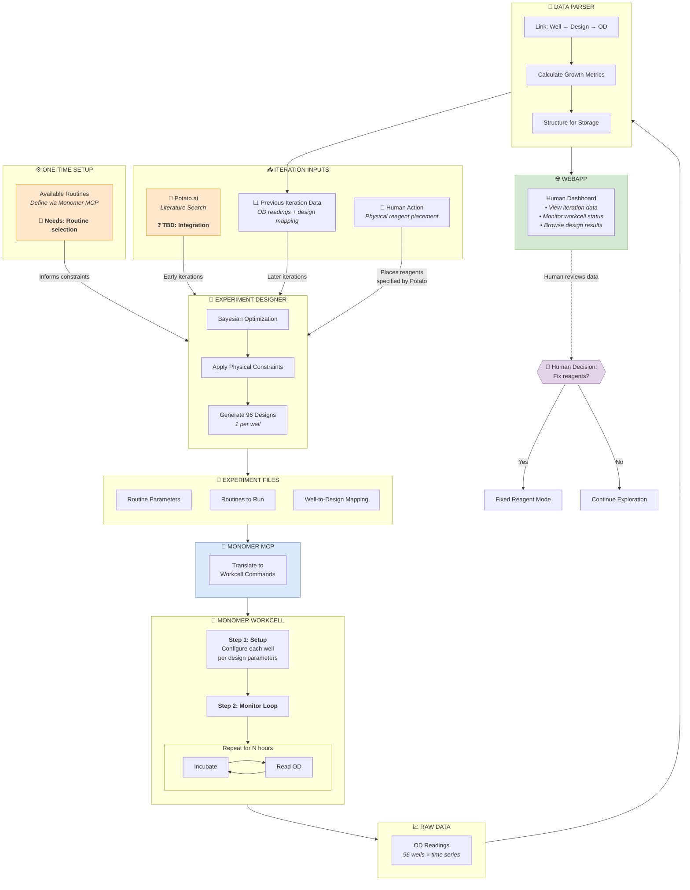
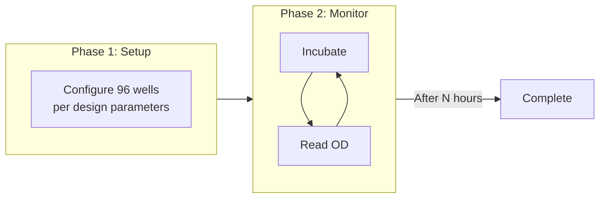
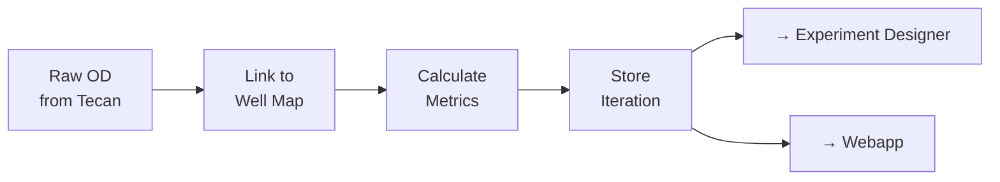
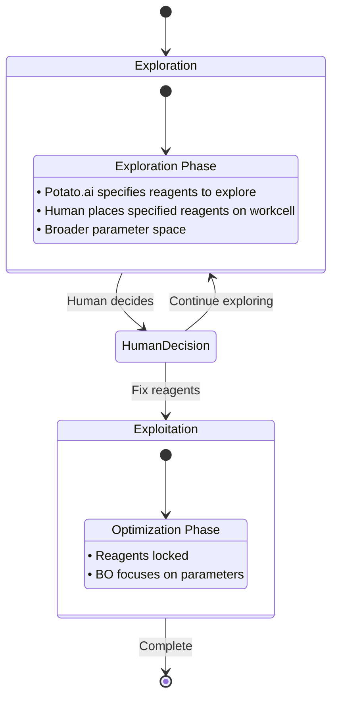
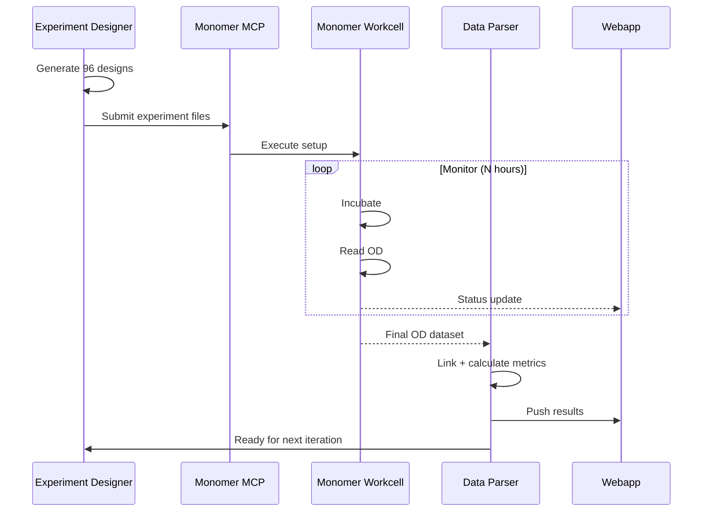

# Closed-Loop AI Scientist for Cell Culture Optimization

## Objective

**Optimize growth conditions for a cell line** by combining Monomer's robotic workcell for automated experimentation with an AI scientist backend for intelligent experimental design.

## Document status

| Section | Status |
|---------|--------|
| System Architecture | ✅ Defined |
| Experiment Designer | 🔶 Partially Defined |
| Potato.ai Integration | ❓ TBD |
| Monomer MCP Interface | 🔶 Partially Defined |
| Data Pipeline | 🔶 Partially Defined |
| Webapp | 🔶 Partially Defined |

**Legend**: ✅ Defined | 🔶 Partially Defined | ❓ To Be Determined

---

## 1. System Architecture

### Core Loop

```
┌─────────────────────────────────────────────────────────────────────────────────┐
│                                                                                 │
│   ┌──────────────┐    ┌──────────────┐    ┌──────────────┐    ┌──────────────┐ │
│   │  Experiment  │───▶│   Monomer    │───▶│   Monomer    │───▶│    Data      │ │
│   │   Designer   │    │     MCP      │    │   Workcell   │    │   Parser     │ │
│   └──────────────┘    └──────────────┘    └──────────────┘    └──────────────┘ │
│          ▲                                                          │          │
│          │                                                          │          │
│          └──────────────────────────────────────────────────────────┘          │
│                              Feedback Loop                                      │
│                                        │                                        │
│                                        ▼                                        │
│                                 ┌──────────────┐                               │
│                                 │    Webapp    │                               │
│                                 │  (Human View)│                               │
│                                 └──────────────┘                               │
└─────────────────────────────────────────────────────────────────────────────────┘
```

### Full System Diagram



---

## 2. Components

### 2.1 Experiment Designer

**Status**: 🔶 Partially Defined

The "brain" of the system. Uses Bayesian Optimization to generate experimental designs based on available data and physical constraints.

| Aspect | Decision |
|--------|----------|
| Core Algorithm | Bayesian Optimization |
| Agent Extension | Lower priority (future) |

**Inputs**

| Input | Source | When |
|-------|--------|------|
| Literature parameters | Potato.ai | Early iterations |
| Experimental results | Data Parser | Later iterations |
| Available routines | Monomer MCP | One-time setup |
| Reagent specification | Potato.ai | Early iterations |
| Physical reagent placement | Human | Early iterations (places what Potato specifies) |

**Outputs**

| Output | Description |
|--------|-------------|
| Routine parameters | Parameters for each routine to execute |
| Routines to run | Sequence of Monomer workcell routines |
| Well-to-design mapping | Links each of 96 wells to its design |

**Constraint**: All iterations must end with OD measurement.

---

### 2.2 Potato.ai Integration

**Status**: ❓ To Be Determined

Provides literature-based guidance for early iterations before sufficient experimental data exists.

| Question | Priority |
|----------|----------|
| How to interface with it Potato.ai for the early itterations? (API / tool / service) | High |
| What data format does it return? | High |

---

### 2.3 Monomer MCP Interface

**Status**: 🔶 Partially Defined

Translates experiment files into Monomer workcell commands and retrieves data.

**What's Defined**
- MCP connection is established and working
- Basic tools are available for querying plates and cultures

**Known Routines**

| Routine | Purpose |
|---------|---------|
| Measure Absorbance | OD600 reading (required every iteration) |
| Same Plate Passage | Cell passaging with configurable parameters |

**Available MCP Tools** (from current setup)

- `list_plates`, `get_plate_details`, `get_plate_observations`
- `list_cultures`, `get_culture_details`

**Remaining Work**

| Question | Priority |
|----------|----------|
| Which routines are available for our use case? | High |
| Which routines do we want to define/request? | High |
| Define MCP workflow for experiment submission to Monomer workcell | Medium |
| Define MCP workflow for OD data retrieval from Monomer workcell | Medium |

---

### 2.4 Monomer Workcell Execution

**Two-Phase Execution**



**Hardware**
- Tecan Infinite Platereader (OD measurement)
- Opentrons OT-2 (liquid handling)
- Liconic incubators (temperature control)
- PAA KX-2 robot arm (plate transport)

---

### 2.5 Data Parser

**Status**: 🔶 Partially Defined

Transforms raw OD data into structured datasets linking designs to outcomes.

**Processing Steps**



**Core Data Structure**

```
Iteration N
├── metadata (id, timestamps, reagents)
├── designs (96 entries: well → parameters)
└── results (96 entries: well → OD time series + metrics)
```

**Calculated Metrics** (per well)

| Metric | Purpose |
|--------|---------|
| Exponential slope | Primary optimization target |
| Doubling time | Interpretable growth metric |
| R² value | Data quality indicator |

---

### 2.6 Webapp

**Status**: 🔶 Partially Defined

Dashboard for humans to monitor the system and review results.

**Features**

| Feature | Description | Priority |
|---------|-------------|----------|
| Iteration view | 96-well heatmap + OD curves for each well | High |
| Design details | View parameters for any well | High |
| Workcell status | Live updates from Monomer workcell | High |
| History | Browse past iterations | Medium |
| Comparison | Compare designs across iterations | Lower |

---

### 2.7 Transition Logic

**Status**: ✅ Defined



**Trigger**: Human operator decides when to transition to fixed reagents (via Webapp review). Once transitioned, reagents are locked and no longer need to be placed.

---

## 3. Data Flow

### Per-Iteration Sequence



### File Organization

```
data/
└── iterations/
    └── iter_001/
        ├── input/
        │   ├── routine_parameters.json
        │   ├── routines_to_run.json
        │   └── well_to_design_mapping.json
        ├── output/
        │   └── od_readings.csv
        └── analysis/
            └── growth_metrics.json
```

---

## 4. Action Items

### High Priority

| Component | Action |
|-----------|--------|
| Potato.ai | Determine integration method |
| Potato.ai | Define output schema |
| Monomer MCP | Determine which routines are available |
| Monomer MCP | Define which routines we need for experiments |
| Monomer MCP | Define experiment submission workflow |
| Data Parser | Implement well-to-design linking |

### Medium Priority

| Component | Action |
|-----------|--------|
| Experiment Designer | Implement Bayesian Optimization |
| Webapp | Build iteration dashboard |
| Data Parser | Implement metric calculations |

### Lower Priority

| Component | Action |
|-----------|--------|
| Transition | System-proposed transition |
| Experiment Designer | Agent-based wrapper |
| Webapp | Cross-iteration comparison |

---

## 5. Open Questions

| ID | Question | Component |
|----|----------|-----------|
| Q1 | How does Potato.ai interface with our system? | Potato.ai |
| Q2 | Which available routines fit our experimental needs? | Monomer MCP |
| Q3 | Do we need to define custom routines, or use existing ones? | Monomer MCP |
| Q4 | How long should each monitoring phase run? | Experiment Designer |

---

## Glossary

| Term | Definition |
|------|------------|
| Iteration | One complete cycle: design → execute → measure → analyze |
| Design | Experimental parameters for one well |
| OD | Optical Density at 600nm (cell density proxy) |
| Routine | A Monomer workcell operation |
| Transition | Switch from reagent exploration to fixed-reagent optimization |

---
